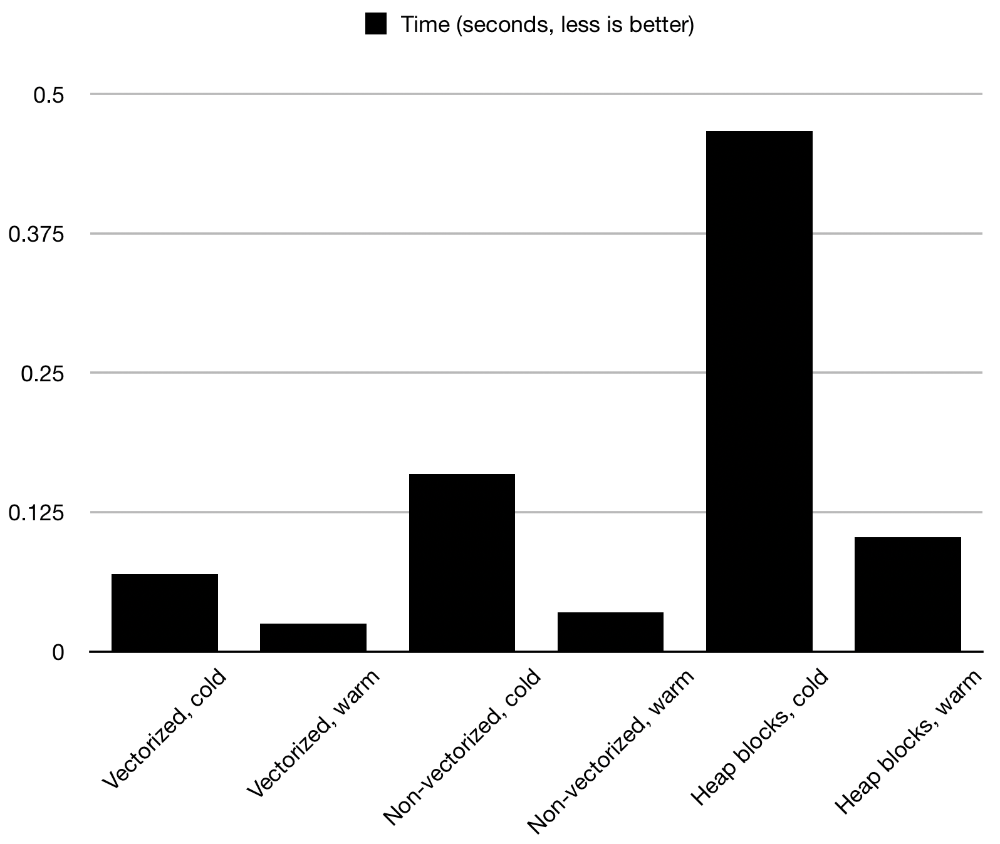

# vectorize_test
This is a small test program that tests the performance difference between vectorized
and non-vectorized code, for various storage scenario's (SoA, AoS, Heap blocks).

## Run the code
This application requires the bake build system. To install bake, see:
https://github.com/SanderMertens/bake

After bake is installed, do:
```
bake clone SanderMertens/vectorize_test --cfg release
bake run vectorize_test --cfg release
```

## Description
Four different scenarios are tested, each adding a floating point `speed` 
value to an `x` and `y` value. The scenarios are only different in the way that
the data is stored in memory.

Each test is ran twice, to show the difference between a "cold" and "warm" test.
The second time the test is ran, data is already in the CPU cache, and as a
result, the test runs significantly faster.

### Attributes in separate arrays (SoA)
In this scenario, each attribute (`x`, `y`, `speed`) is in its own separate array.

### Position attributes in same struct (SoA, components)
In this scenario, the `x` and `y` attributes are in a `Position` struct. The
`Position` struct and `speed` data are in separate arrays.

### All attributes in the same struct (AoS)
In this scenario the `x`, `y` and `speed` data are all in an `Entity` struct. To
mimic actual OOP-style applications, this struct also has additional members
which are not evaluated by the test. All entities are stored in the same array.

### All attributes in the same struct, each entity its own heap alloc
This scenario uses the same `Entity` struct, but instead of storing all entities
in the same array, all entities are allocated separately on the heap. To mimic
actual applications, small chunks of "garbage" data is allocated inbetween the
entities, to more accurately simulate OOP applications where objects of the same
kind are typically scattered across the heap.

## Benchmarks
Here are the benchmarks as measured on a 15-inch 2018 Macbook with a 2.6Ghz 
Intel i7, on MacOS 10.14.1. While I was testing, I used these compilation options
to verify if code was being vectorized:

```
-Rpass=loop-vectorize -Rpass-missed=loop-vectorized -Rpass-analysis=loop-vectorize -fsave-optimization-record
```

The used compiler is clang:

```
$ clang --version
Apple LLVM version 10.0.0 (clang-1000.10.44.4)
Target: x86_64-apple-darwin18.2.0
Thread model: posix
InstalledDir: /Library/Developer/CommandLineTools/usr/bin
```

### Graph (10 million entities):


### Raw numbers:
```
-- Preparing data for 100000 entities
-- Start benchmarks
   SoA, cold:                    0.000472 (V)
   SoA, warm:                    0.000040 (V)
   SoA, cold:                    0.000494
   SoA, warm:                    0.000072
   SoA (components), cold:       0.000530 (V)
   SoA (components), warm:       0.000044 (V)
   SoA (components), cold:       0.000501
   SoA (components), warm:       0.000047
   AoS, cold:                    0.001353 (V)
   AoS, warm:                    0.000149 (V)
   AoS, cold:                    0.001393
   AoS, warm:                    0.000241
   Heap blocks, cold:            0.004299
   Heap blocks, warm:            0.000700
-- Cleaning up data
-- Benchmarks done

-- Preparing data for 1000000 entities
-- Start benchmarks
   SoA, cold:                    0.004887 (V)
   SoA, warm:                    0.000691 (V)
   SoA, cold:                    0.005121
   SoA, warm:                    0.000908
   SoA (components), cold:       0.004770 (V)
   SoA (components), warm:       0.000728 (V)
   SoA (components), cold:       0.004803
   SoA (components), warm:       0.000699
   AoS, cold:                    0.014312 (V)
   AoS, warm:                    0.006410 (V)
   AoS, cold:                    0.015699
   AoS, warm:                    0.002396
   Heap blocks, cold:            0.044969
   Heap blocks, warm:            0.007181
-- Cleaning up data
-- Benchmarks done

-- Preparing data for 10000000 entities
-- Start benchmarks
   SoA, cold:                    0.049978 (V)
   SoA, warm:                    0.006898 (V)
   SoA, cold:                    0.053010
   SoA, warm:                    0.008589
   SoA (components), cold:       0.049868 (V)
   SoA (components), warm:       0.009214 (V)
   SoA (components), cold:       0.050274
   SoA (components), warm:       0.008972
   AoS, cold:                    0.144375 (V)
   AoS, warm:                    0.031099 (V)
   AoS, cold:                    0.150992
   AoS, warm:                    0.029872
   Heap blocks, cold:            0.441388
   Heap blocks, warm:            0.095193
-- Cleaning up data
-- Benchmarks done

-- Preparing data for 50000000 entities
-- Start benchmarks
   SoA, cold:                    0.255149 (V)
   SoA, warm:                    0.045890 (V)
   SoA, cold:                    0.274943
   SoA, warm:                    0.055243
   SoA (components), cold:       0.251610 (V)
   SoA (components), warm:       0.049339 (V)
   SoA (components), cold:       0.258969
   SoA (components), warm:       0.047749
   AoS, cold:                    0.731237 (V)
   AoS, warm:                    0.172279 (V)
   AoS, cold:                    0.789500
   AoS, warm:                    0.171129
   Heap blocks, cold:            3.145075
   Heap blocks, warm:            4.411898
-- Cleaning up data
-- Benchmarks done

-- Preparing data for 100000000 entities
-- Start benchmarks
   SoA, cold:                    0.504031 (V)
   SoA, warm:                    0.094239 (V)
   SoA, cold:                    0.532266
   SoA, warm:                    0.107558
   SoA (components), cold:       0.523265 (V)
   SoA (components), warm:       0.094738 (V)
   SoA (components), cold:       0.548549
   SoA (components), warm:       0.098777
   AoS, cold:                    1.893241 (V)
   AoS, warm:                    0.540263 (V)
   AoS, cold:                    2.716844
   AoS, warm:                    0.673439
   Heap blocks, cold:            9.967291
   Heap blocks, warm:            9.589913
-- Cleaning up data
-- Benchmarks done

-- Preparing data for 200000000 entities
-- Start benchmarks
   SoA, cold:                    1.060541 (V)
   SoA, warm:                    0.193708 (V)
   SoA, cold:                    1.118334
   SoA, warm:                    0.238428
   SoA (components), cold:       1.098434 (V)
   SoA (components), warm:       0.239901 (V)
   SoA (components), cold:       1.684362
   SoA (components), warm:       0.595149
   AoS, cold:                    4.729489 (V)
   AoS, warm:                    6.190474 (V)
   AoS, cold:                    4.169101
   AoS, warm:                    5.583190
   Heap blocks, cold:            20.845281
   Heap blocks, warm:            21.129561
-- Cleaning up data
-- Benchmarks done

```
