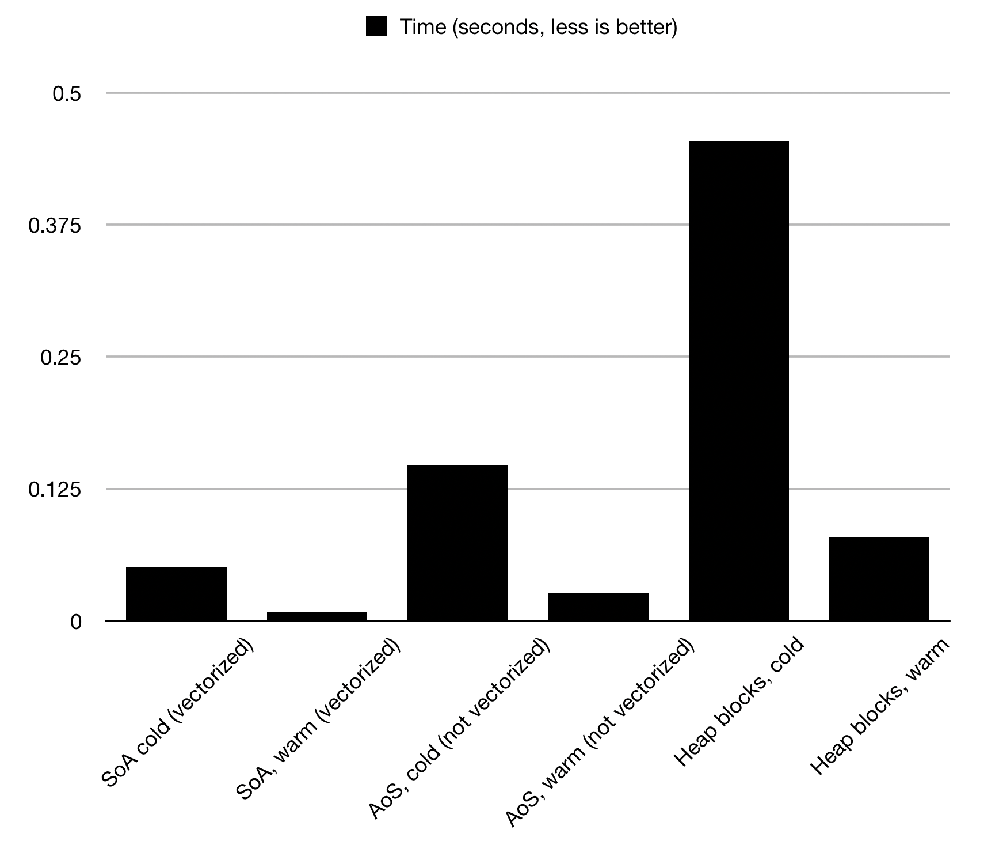

# vectorize_test
This is a small test program that tests the performance difference between vectorized
and non-vectorized code. When comparing the worst with the best case, the test can
run as much as 40x faster.

## Run the code
This application requires the bake build system. To install bake, see:
https://github.com/SanderMertens/bake

After bake is installed, do:
```
bake clone SanderMertens/vectorize_test
bake run vectorize_test --cfg release
```

## Description
Four different scenarios are tested, each adding a floating point `speed` 
value to an `x` and `y` value. The scenarios are only different in the way that
the data is stored in memory.

Each test is ran twice, to show the difference between a "cold" and "warm" test.
The second time the test is ran, data is already in the CPU cache, and as a
result, the test runs significantly faster.

### Attributes in separate arrays (AoS)
In this scenario, each attribute (`x`, `y`, `speed`) is in its own separate array.

### Position attributes in same struct (AoS, components)
In this scenario, the `x` and `y` attributes are in a `Position` struct. The
`Position` struct and `speed` data are in separate arrays.

### All attributes in the same struct (SoA)
In this scenario the `x`, `y` and `speed` data are all in an `Entity` struct. To
mimic actual OOP-style applications, this struct also has additional members
which are not evaluated by the test. All entities are stored in the same array.

### All attributes in the same struct, each entity its on heap alloc
This scenario uses the same `Entity` struct, but instead of storing all entities
in the same array, all entities are allocated separately on the heap. To mimic
actual applications, small chunks of "garbage" data is allocated inbetween the
entities, to more accurately simulate OOP applications where objects of the same
kind are typically scattered across the heap.

## Benchmarks
Here are the benchmarks as measured on a 15-inch 2018 Macbook with a 2.6Ghz 
Intel i7, on MacOS 10.14.1. While I was testing, I used these compilation options
to verify if code was being vectorized:

```
-Rpass=loop-vectorize -Rpass-missed=loop-vectorized -Rpass-analysis=loop-vectorize -fsave-optimization-record
```

The used compiler is clang:

```
$ clang --version
Apple LLVM version 10.0.0 (clang-1000.10.44.4)
Target: x86_64-apple-darwin18.2.0
Thread model: posix
InstalledDir: /Library/Developer/CommandLineTools/usr/bin
```

### Graph (10 million entities):


### Raw numbers:
```
-- Preparing data for 100000 entities
-- Start benchmarks
   SoA, cold:                    0.000510 (V)
   SoA, warm:                    0.000040 (V)
   SoA (components), cold:       0.000487 (V)
   SoA (components), warm:       0.000045 (V)
   AoS, cold:                    0.001398
   AoS, warm:                    0.000184
   Heap blocks, cold:            0.004395
   Heap blocks, warm:            0.000671
-- Cleaning up data
-- Benchmarks done

-- Preparing data for 1000000 entities
-- Start benchmarks
   SoA, cold:                    0.004850 (V)
   SoA, warm:                    0.000676 (V)
   SoA (components), cold:       0.004836 (V)
   SoA (components), warm:       0.000766 (V)
   AoS, cold:                    0.015199
   AoS, warm:                    0.002706
   Heap blocks, cold:            0.046170
   Heap blocks, warm:            0.008975
-- Cleaning up data
-- Benchmarks done

-- Preparing data for 1000000 entities
-- Start benchmarks
   SoA, cold:                    0.001515 (V)
   SoA, warm:                    0.000642 (V)
   SoA (components), cold:       0.001702 (V)
   SoA (components), warm:       0.000866 (V)
   AoS, cold:                    0.005363
   AoS, warm:                    0.002759
   Heap blocks, cold:            0.047522
   Heap blocks, warm:            0.008795
-- Cleaning up data
-- Benchmarks done

-- Preparing data for 10000000 entities
-- Start benchmarks
   SoA, cold:                    0.050321 (V)
   SoA, warm:                    0.008190 (V)
   SoA (components), cold:       0.052929 (V)
   SoA (components), warm:       0.008695 (V)
   AoS, cold:                    0.149097
   AoS, warm:                    0.030550
   Heap blocks, cold:            0.476867
   Heap blocks, warm:            0.104416
-- Cleaning up data
-- Benchmarks done

-- Preparing data for 50000000 entities
-- Start benchmarks
   SoA, cold:                    0.261631 (V)
   SoA, warm:                    0.047819 (V)
   SoA (components), cold:       0.272194 (V)
   SoA (components), warm:       0.049514 (V)
   AoS, cold:                    0.779598
   AoS, warm:                    0.170067
   Heap blocks, cold:            3.181558
   Heap blocks, warm:            4.502359
-- Cleaning up data
-- Benchmarks done

-- Preparing data for 100000000 entities
-- Start benchmarks
   SoA, cold:                    0.536632 (V)
   SoA, warm:                    0.095812 (V)
   SoA (components), cold:       0.532833 (V)
   SoA (components), warm:       0.104858 (V)
   AoS, cold:                    1.996591
   AoS, warm:                    1.958505
   Heap blocks, cold:            8.642156
   Heap blocks, warm:            10.046488
-- Cleaning up data
-- Benchmarks done

-- Preparing data for 200000000 entities
-- Start benchmarks
   SoA, cold:                    1.042337 (V)
   SoA, warm:                    0.192516 (V)
   SoA (components), cold:       1.091144 (V)
   SoA (components), warm:       0.203515 (V)
   AoS, cold:                    4.620915
   AoS, warm:                    6.190330
   Heap blocks, cold:            16.328733
   Heap blocks, warm:            23.154768
-- Cleaning up data
-- Benchmarks done
```
